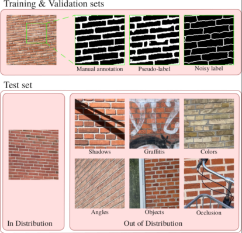

# TopoMortar
Official repository of "**TopoMortar: A dataset to evaluate image segmentation methods focused on topology accuracy**".

This repository contains TopoMortar dataset and the code to evaluate topology loss functions.

### Latest updates
📅 05-Mar-25: Release of TopoMortar dataset.

### TODO
* ☐ Add Betti Matching error to the metrics.
* ☐ Add clDice to the metrics.

### Latest results (Last update 05-Mar-25)
[Here](results/PERFORMANCE_TABLES.md), we present an extensive comparison between topology loss functions under different dataset challenges, illustrating when/if topology loss functions are beneficial and truly incorporate prior topology information to the model.

#### Evaluated topology loss functions to date
Rank Loss Type GPU CPU Worked?

<table>
<thead>
<tr>
	<th>Rank</th><th>Loss</th><th>Type</th><th>GPU (GiB)</th><th>Time (h.)</th>
</tr>
</thead>
<tbody>
<tr>
	<td>1</td><td>clDice (Shit et al., 2021, CVPR)</td><td>Skeleton</td><td>16.2</td><td>3.1</td>
</tr>
<tr>
	<td>2</td><td>SkelRecall (Kirchhoff et al, 2024, ECCV)</td><td>Skeleton</td><td>5.6</td><td>7.1</td>
</tr>
<tr>
	<td>3</td><td>TopoLoss (Hu et al., 2019, NeurIPS)</td><td>Persistence homology</td><td>5.6</td><td>49.6</td>
</tr>
<tr>
	<td>4</td><td>Warping (Hu et al, 2022, NeurIPS)</td><td>Distance</td><td>5.6</td><td>152.1</td>
</tr>
<tr>
	<td>5</td><td>cbDice (Shi et al, 2024, MICCAI)</td><td>Skeleton</td><td>7.8</td><td>58.3</td>
</tr>
<tr>
	<td>6</td><td>TOPO (Oner et al., 2021, TPAMI)</td><td>Distance</td><td>5.9</td><td>28.8</td>
</tr>
<tr>
	<td>-</td><td>Betti Matching (Stucki et al., 2023, ICML)</td><td>Persistence homology</td><td>-</td><td>-</td>
</tr>
<tr>
	<td>-</td><td>TopoGrad (Clough et al., 2019, ICIPMI)</td><td>Persistence homology</td><td>-</td><td>-</td>
</tr>
<tr>
	<td>-</td><td>CavityLoss (Ngoc et al., 2022, NeurIPS Workshop)</td><td>Persistence homology</td><td>-</td><td>-</td>
</tr>
</tbody>
</table>

More details on why Betti Matching, TopoGrad, and CavityLoss didn't work can be found below, in 3.3 (notes).

## Table of Contents
* [1. Introduction](#1-introduction)
* [2. TopoMortar](#2-topomortar)
  * [2.1 How to use TopoMortar](#21-how-to-use-topomortar)
  * [2.2 How to NOT use TopoMortar](#22-how-to-not-use-topomortar)
* [3. Reproducibility](#3-reproducibility)
  * [3.1 File structure of this repository](#31-file-structure-of-this-repository)
  * [3.2 Installation and requirements](#32-installation-and-requirements)
  * [3.3 Run experiments](#33-run-experiments)
* [4. Contribute](#4-contribute)
* [5. Citation](#5-citation)
* [6. Contact](#6-contact)

## 1. Introduction
Existing datasets used to evaluate topology loss functions present challenges that might have caused topology loss functions to appear advantageous.
Since these challenges have not been discussed or accounted for, it is unknown whether topology loss functions are advantageous only under the presence of such specific challenges.
Consider, for example, Dice loss in a class-imbalanced dataset; because Dice loss tackles class imbalance and, consequently, achieves higher performance and, in turn, also achieves higher topology accuracy, one could conclude that Dice loss is a great topology loss function.
But, what **if we tackle dataset challenges directly? Would topology loss functions still be advantageous?**
Can we verify whether topology loss functions incorporate prior topological knowledge to the models and not exploit specific dataset challenges in order to improve performance?
What if we use the topology loss functions in a scenario without dataset challenges?
Will they improve topology accuracy?
Moreover, if we can tackle dataset challenges easily and the advantageousness of topology loss functions disappear, can we say that such topology loss functions are useful?
Considering that topology loss functions increase computational requirements (in some cases, heavily), these are important questions to answer.

Our work aims to answer all these questions.
Our work contributes to deep learning, image segmentation, and topology by:
1. providing a unique dataset (TopoMortar) to investigate the advantageousness of topology-focused image segmentation methods under different dataset challenges and without challenges, and by
2. investigating the potential advantageousness of several topology loss functions with unprecedentedly-extensive experiments (10 random seeds, SOTA segmentation model, strong data augmentation).

## 2. TopoMortar
TopoMortar dataset in a nutshell 🥜:
* 420 images for the segmentation of mortar in red brick wall.
* Specific training-validation-test splits (50-20-350) ([here](dataset/splits.yaml)).
* Additionall training set split of only 10 images (subset of the large one) ([here](dataset/splits_small.yaml)).
* Manual annotations for all images.
* Noisy and pseudo-labels for the training and validation sets as well.
* 300 out-of-distribution test-set images (6 categories of 50 images each) ([here](dataset/dataset_types.txt))



### 2.1 How to use TopoMortar
TopoMortar can be used in a similar way as other datasets, as it specifies a training, validation, and test set, and it includes accurate labels permitting standard supervised learning.
However, TopoMortar allows to do much more than that.
Thus, we encourage researchers to utilize TopoMortar as a mean to portray dataset challenges (more details in the paper and [here](results/PERFORMANCE_TABLES.md)).
**The easiest way to utilize TopoMortar is by portraying an ideal setting, where increases in topology accuracy are hard to obtain**.
This means: Train on the **large** 50-images training set with **accurate** labels, and report results **only on the in-distribution test set** (see the "Training Example" below, in Section 3.3 Run experiments).
Sounds simple? In our experiments, only clDice achieved better results than Cross entropy + Dice loss (Table 3 of the paper, Top rows).

### 2.2 How to NOT use TopoMortar
If you use TopoMortar, avoid mixing in-distribution (ID) and out-of-distribution (OOD) test set results.
In other words, you should report ID and OOD performance **separately**.
Since there are 300 OOD images vs. only 50 ID in the test set, an increase in performance in the OOD images by, e.g., RandHue data augmentation (this is a simple non-topology related data augmentation described in Section 4.4) would make it appear as if it generally improved topology accuracy.

## 3. Reproducibility

### 3.1 File structure of this repository
```cshell
.
 ├─train.py # Script to run the experiments. See how to use it in `3.3 Run experiments`
 ├─pred.py # Script to compute the predictions (inference)
 ├─measure.py # Script to measure the performance on the test set predictions
 ├─dataset/ # TopoMortar dataset
 │ ├─betti_numbers.csv # The Betti numbers of the test set images
 │ ├─dataset_types.txt # Correspondance between images and their group (in distr. and OOD)
 │ ├─splits.yaml # Train, validation and test set splits for the "Large training set" setting
 │ ├─splits_small.yaml # Train, validation and test set splits for the "Small training set" setting
 │ └─train|val|test/
 │   ├─images # Brick images
 │   ├─accurate # Manually refined labels
 │   ├─noisy # Noisy labels (only train and validation sets)
 │   └─pseudo # Pseudo labels (only train and validation sets)
 ├─config/
 │ └─template_topomortar.yaml # Default configuration of an experiment
 └─lib/
   ├─callback.py # Callback functions called during training
   ├─core.py # Functions to train and evaluate the models
   ├─losses.py # Loss functions
   ├─losses_xxxx.py # Loss function-specific helpers (to avoid cluttering losses.py)
   ├─metrics.py # Metrics to measure performance
   ├─transforms.py # Where RandHue transformation is defined
   ├─utils.py # Useful functions
   └─data/
     └─TopoMortar.py # TopoMortar's Dataset file
```

### 3.2 Installation and requirements

#### Create a virtual environment and download TopoMortar
You don't need to worry about where to put the dataset, or setting up paths.
Follow these instructions, and you will be able to run "python train.py..." directly.

``` cshell
python -m venv /PATH/envs/topomortar
source /PATH/envs/topomortar/bin/activate
git clone git@github.com:jmlipman/TopoMortar.git
cd TopoMortar
```

#### Install dependencies
As of today (March 2025), the code in this repository works with the latest libraries.
If you have problems with a particular library, you can see the exact version used in [requirements.txt](requirements.txt)
``` cshell
pip3 install torch torchvision torchaudio --index-url https://download.pytorch.org/whl/cu118
pip3 install monai PyYAML pandas nibabel scipy opencv-python scikit-image matplotlib medpy
```

Specificallly for TOPO loss (MSETopoWinLoss), you need:
``` cshell
git clone https://github.com/TuragaLab/malis.git
cd malis
./make.sh
```

Specifically for BettiMatching and TopoLoss, you need:
``` cshell
pip3 install gudhi POT
```

Specifically for Warping loss, you need:
``` cshell
pip3 install connected-components-3d
```


### 3.3 Run experiments

#### Training

``` python
>>> python train.py --labels LABEL --training_set_size IMSIZE --loss LOSS --framework FRAME --random_seed RANDSEED --output OUTPATH
```

* LABEL: **accurate** or **noisy** or **pseudo**.
* IMSIZE: **large** or **small**.
* LOSS: **CEDiceLoss** or **clDiceLoss** or **RegionWiseLoss** or **MSETopoWinLoss** or **CESkeletonRecallLoss** or **cbDiceLoss** or **WarpingLoss** or **TopoLoss**.
* FRAME: **supervised** or **selfdistillation** or **randhue**.
* RANDSEED: Random seed (e.g., **42**).
* OUTPATH: Path where the output will be save. It create subpaths based on the configuration and run (e.g., **/home/user/output/topomortar**).

Example:
``` python
>>> python train.py --labels accurate --training_set_size large --loss CEDiceLoss --framework supervised --random_seed 42 --output /path/to/folder
```

After training, a *config.yaml* file will be generated in --output.
This file will be used for inference and measuring the performance metrics.

#### Inference
Provide the config.yaml file generated by the training script.
This will create a folder called 'preds' with the segmentation masks saved as PNGs.

``` python
>>> python pred.py --config /path/to/the/file/config.yaml
```

#### Metrics
Provide the config.yaml file generated by the training script.
This will create a CSV file called 'results.csv' with the performance metrics for each prediction.
``` python
>>> python measure.py --config /path/to/the/file/config.yaml
```

#### Notes about the code and experiments
1. This code has been simplified to enhance readability, allowing to run all experiments reported in the paper involving TopoMortar.
2. TopoLoss and Warping loss are very slow. In my experiments, I used them after 70% of the training combined with another loss function. You can change that by specifying the parameter *activate_when*. To run them all the time, you can set *activate_when=0*. Also, since I use Deep supervision, the loss function is called a few times in every iteration, so, you could set it up to run it only on the output of the model and not on the intermediate outputs.
3. [lib/losses.py](lib/losses.py) also includes three loss functions that I couldn't use.
    * DiceBettiMatchingLoss requires centuries (literally) to run on TopoMortar.
    * TopoGradLoss requires TopologyLayer that [I wasn't able to install](https://github.com/bruel-gabrielsson/TopologyLayer/issues/49).
    * CavityLoss required MBD which requires compiling C++ code, which I couldn't do on the cluster.
4. Most topology loss functions are not originally implemented for multi-class tasks, and some are not either implemented for 3D images.
5. I always used the official source code of every loss function, but for TopoLoss I slightly modified it to increase readability.

## 4. Contribute
You can contribute in this repository by adding more frameworks, topology loss functions, and metrics..

As a researcher, you can also contribute in your work by:
* Discussing the datasets you use and their challenges.
* Providing averages and stds across multiple runs with three or more random seeds.
* Training more recent segmentation models (e.g., nnUNet)
* Using strong data augmentation.

## 5. Citation

```bibtex
@misc{topomortar-valverde,
  author = {Juan Miguel Valverde and Motoya Koga and Nijihiko Otsuka and Anders B. Dahl},
  title = {TopoMortar: A dataset to evaluate image segmentation methods focused on topology accuracy}
  year = {2025},
  publisher = {GitHub},
  journal = {GitHub repository},
  howpublished = {\url{https://github.com/jmlipman/TopoMortar}}
}
```

## 6. Contact
If you also work on topology-aware image segmentation methods, I'm looking forward to collaborating with you ;)
Feel free to open a new Issue or reach me at jmvma@dtu.dk.
